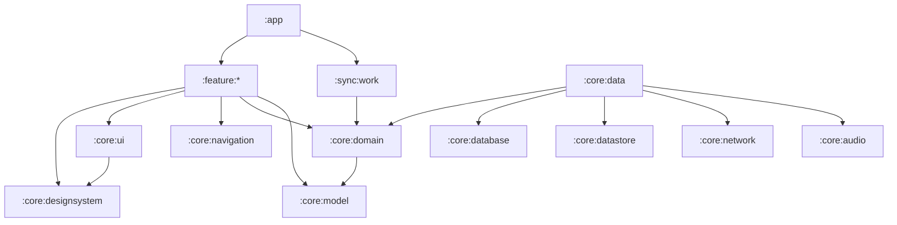

# Talkship Android Architecture

> Production architecture and multi-module conventions for the Talkship Android application.

## 1. Status and Scope

Talkship is an Android-first conversational translation application focused on:

- real-time speech capture;
- speech-to-text and translation;
- translated text-to-speech playback;
- live bilingual transcripts;
- conversation history;
- language, audio, privacy, and account settings.

The repository currently starts from a single `:app` module. The structure in this
document is the target production architecture. Modules should be extracted
incrementally according to the migration plan in section 23; a module does not
exist merely because it is listed here.

## 2. Architecture Goals

The architecture MUST support:

- independent feature development and testing;
- strict dependency direction and replaceable implementations;
- reliable long-running audio and translation sessions;
- offline-tolerant history and recoverable network operations;
- secure handling of audio, transcripts, credentials, and user preferences;
- fast local builds and selective CI execution;
- clear ownership of UI state and business rules;
- gradual product growth without turning `:app` into a monolith.

The architecture SHOULD remain simpler than the product. New layers and modules
must solve an actual ownership, build, reuse, or isolation problem.

## 3. Core Principles

1. **Feature first**: product behavior belongs to feature modules.
2. **Unidirectional data flow**: UI emits actions and renders immutable state.
3. **Dependency inversion**: domain contracts do not depend on data or platform implementations.
4. **Single source of truth**: persisted application data is observed from repositories.
5. **Offline tolerant**: temporary network failure must not corrupt a session or history.
6. **Explicit side effects**: audio, network, storage, navigation, and analytics are isolated.
7. **Privacy by design**: collect and retain the minimum data required.
8. **No Android in pure domain code**: business models and use cases remain platform independent.
9. **API before implementation**: cross-module dependencies use small public contracts.
10. **Production visibility**: failures and performance are observable without logging sensitive content.

## 4. Technology Baseline

Recommended production baseline:

- Kotlin;
- Jetpack Compose and Material 3 as UI foundations;
- Kotlin Coroutines and `Flow`;
- Navigation Compose;
- ViewModel and Saved State;
- dependency injection with Hilt;
- Room for structured local persistence;
- DataStore for user preferences;
- Retrofit/OkHttp or Ktor for HTTP APIs;
- WorkManager for deferrable background synchronization;
- Media3 and Android audio APIs where appropriate;
- Kotlin Serialization or Moshi for wire models;
- JUnit, kotlinx-coroutines-test, Turbine, MockK/Fakes, and Compose UI tests;
- Gradle Version Catalog and convention plugins.

Libraries are implementation choices, not architecture boundaries. Their types
must not leak into domain contracts unless the type is a stable Kotlin or Android
platform abstraction intentionally accepted by the architecture.

## 5. Target Module Map

```text
talkship/
├── app/
├── build-logic/
│   └── convention/
├── core/
│   ├── common/
│   ├── model/
│   ├── designsystem/
│   ├── ui/
│   ├── navigation/
│   ├── domain/
│   ├── data/
│   ├── database/
│   ├── datastore/
│   ├── network/
│   ├── audio/
│   ├── permissions/
│   ├── analytics/
│   └── testing/
├── feature/
│   ├── home/
│   ├── conversation/
│   ├── history/
│   ├── settings/
│   ├── onboarding/
│   └── account/
└── sync/
    └── work/
```

Do not create every target module on day one. Start with modules that establish
dependency direction and then extract modules when their responsibilities become
real.

### 5.1 `:app`

The application shell and composition root.

Owns:

- `Application` and `MainActivity`;
- root navigation host;
- global dependency injection wiring;
- build variants, signing, packaging, and application manifest;
- top-level lifecycle coordination;
- feature module assembly.

Must not own:

- reusable UI components;
- feature business logic;
- repository implementations;
- database queries;
- network request logic.

### 5.2 `:build-logic:convention`

Gradle convention plugins shared by all modules.

Owns:

- Android application/library defaults;
- Kotlin and Compose configuration;
- Java/Kotlin toolchain versions;
- lint, static analysis, test, and coverage defaults;
- feature, core, Room, Hilt, and serialization conventions.

This avoids duplicated Gradle configuration and keeps module build files
declarative.

### 5.3 Core modules

| Module | Responsibility |
|---|---|
| `:core:common` | Result types, dispatchers, time providers, logging contracts, and small Kotlin utilities |
| `:core:model` | Stable domain entities shared across features |
| `:core:designsystem` | Talkship tokens, theme, icons, typography, and reusable branded components |
| `:core:ui` | Generic UI utilities, state layouts, formatting helpers, and previews |
| `:core:navigation` | Typed destinations and cross-feature navigation contracts |
| `:core:domain` | Shared use cases and repository contracts used by multiple features |
| `:core:data` | Repository implementations and mapping between network, database, and domain models |
| `:core:database` | Room database, entities, DAOs, migrations, and transaction boundaries |
| `:core:datastore` | Typed preferences and local configuration |
| `:core:network` | API clients, DTOs, authentication interceptors, retry policy, and transport errors |
| `:core:audio` | Recording, playback, audio focus, device routing, and session service integration |
| `:core:permissions` | Permission state and platform permission orchestration |
| `:core:analytics` | Analytics, crash reporting, and performance contracts/implementations |
| `:core:testing` | Shared fakes, fixtures, test rules, and coroutine dispatchers |

`core` is not a dumping ground. A class belongs in `core` only when it is shared,
stable, and not naturally owned by a feature.

### 5.4 Feature modules

Each feature module owns a user-facing capability:

- `:feature:home`: entry point, recent activity, and session launch actions;
- `:feature:conversation`: live capture, translation, transcript, and session controls;
- `:feature:history`: session list, detail, search, delete, export, and share;
- `:feature:settings`: languages, audio behavior, privacy, and appearance;
- `:feature:onboarding`: first-run education and permission setup;
- `:feature:account`: authentication, plan, entitlement, and profile when required.

A feature module normally contains:

```text
feature/conversation/src/main/kotlin/.../
├── navigation/
├── ui/
│   ├── ConversationRoute.kt
│   ├── ConversationScreen.kt
│   ├── ConversationViewModel.kt
│   ├── ConversationUiState.kt
│   └── component/
├── domain/
│   ├── StartConversation.kt
│   └── ObserveConversation.kt
└── di/
```

Feature-local business logic may stay inside the feature. Move it to
`:core:domain` only when multiple features need the same contract or use case.

### 5.5 `:sync:work`

Owns WorkManager workers and scheduling for:

- deferred upload or synchronization;
- retention cleanup;
- retryable metadata operations.

Live audio translation must not run in WorkManager. An active conversation uses
an appropriate foreground service when it must continue beyond the visible
activity lifecycle.

## 6. Dependency Graph



Dependency rules:

- `:app` may depend on all modules required for assembly.
- feature modules must not depend on other feature implementations.
- cross-feature navigation uses contracts from `:core:navigation`.
- domain must not depend on UI, Compose, network, database, or Android framework types.
- data depends inward on domain contracts, never the reverse.
- network DTOs and database entities must not escape their owning modules.
- `:core:designsystem` must not depend on features.
- modules must not use `:app` as a shared dependency.
- cycles are prohibited and should fail CI through dependency analysis.

If direct feature-to-feature reuse appears necessary, extract the shared contract
or component to the smallest suitable core module.

## 7. Layers and Source Ownership

### 7.1 Presentation

Contains Compose UI, ViewModels, UI models, and navigation adapters.

Responsibilities:

- render immutable `UiState`;
- translate user input into `UiAction`;
- collect lifecycle-aware state;
- emit one-time `UiEffect` only when an effect cannot be represented as state;
- convert domain models into display-ready UI models.

Composable functions should remain stateless whenever practical. `Route`
composables connect ViewModels and navigation; `Screen` composables render state
and are directly previewable and testable.

### 7.2 Domain

Contains business models, repository contracts, use cases, and business rules.

Responsibilities:

- conversation lifecycle rules;
- supported language and mode validation;
- transcript ordering and speaker attribution;
- usage limits and entitlement decisions;
- retention and deletion policy;
- application-level error semantics.

Domain code should be deterministic and mostly testable with plain JVM tests.

### 7.3 Data

Contains repositories, data-source coordination, mappers, and cache policy.

Responsibilities:

- select local, remote, or platform data source;
- persist durable state;
- map DTOs/entities to domain models;
- implement retry, cache, and synchronization policy;
- expose observable domain data.

The local database is the source of truth for durable conversation history.
Network responses update local storage, and UI observes repository streams.

### 7.4 Platform

Contains Android-specific integrations such as audio, permissions, foreground
services, connectivity, notifications, secure storage, and sharing.

Platform behavior is hidden behind narrow contracts where it improves testability
or permits provider replacement.

## 8. Unidirectional Data Flow

```text
User input
    -> UiAction
    -> ViewModel
    -> Use case
    -> Repository
    -> Data source
    -> Domain result/stream
    -> UiState
    -> Compose rendering
```

Standard feature contract:

```kotlin
@Immutable
data class ConversationUiState(
    val status: ConversationStatus = ConversationStatus.Idle,
    val sourceLanguage: Language = Language.Auto,
    val targetLanguage: Language,
    val transcript: ImmutableList<TranscriptItem> = persistentListOf(),
    val canStart: Boolean = true,
    val userMessage: UserMessage? = null,
)

sealed interface ConversationAction {
    data object Start : ConversationAction
    data object Pause : ConversationAction
    data object Resume : ConversationAction
    data object Stop : ConversationAction
    data class SelectTargetLanguage(val language: Language) : ConversationAction
}
```

Rules:

- state is immutable and has safe defaults;
- actions express user intent, not widget callbacks;
- durable state lives below the ViewModel;
- `SavedStateHandle` only stores small restorable identifiers and UI choices;
- navigation, permission prompts, and snackbars may be modeled as effects;
- business failures use typed errors, not arbitrary strings or thrown exceptions in UI.

## 9. Conversation and Audio Pipeline

The conversation feature is latency sensitive and requires explicit ownership.

```text
Microphone
  -> Audio recorder
  -> Voice activity detection / chunking
  -> Speech recognition stream
  -> Transcript normalizer
  -> Translation stream
  -> Session repository
  -> Local persistence
  -> UI transcript
  -> Optional TTS playback
```

Production rules:

- exactly one component owns the active recording session;
- recording and playback respect audio focus and route changes;
- headset, Bluetooth, phone-call interruption, and app backgrounding are handled;
- partial STT results are marked separately from finalized transcript segments;
- every transcript item has a stable ID and monotonic sequence;
- streaming updates are throttled or deduplicated before reaching Compose;
- cancellation propagates from UI to all active stream operations;
- reconnects use bounded exponential backoff with jitter;
- a completed local session is not lost when final cloud synchronization fails;
- foreground-service use follows current Android platform requirements;
- audio buffers are bounded and released deterministically.

The audio module owns raw audio mechanics. The conversation feature owns product
state. The data layer owns provider selection and persistence.

## 10. Data Contracts and Persistence

Keep separate models for separate responsibilities:

```text
Network DTO <-> Data mapper <-> Domain model <-> UI model
Database entity <-> Data mapper <-> Domain model
```

Do not reuse one model across all layers merely to reduce mapping code.

Suggested durable entities:

- `ConversationEntity`;
- `TranscriptSegmentEntity`;
- `LanguagePreferenceEntity` only if relational storage is needed;
- `PendingSyncEntity` for operations requiring retry.

Database requirements:

- use stable primary keys generated locally;
- define foreign keys and useful indices;
- make destructive migration a debug-only option;
- export Room schemas to version control;
- test every production migration;
- use transactions for session completion and transcript persistence;
- define retention and deletion behavior explicitly.

DataStore is appropriate for preferences such as selected languages, playback
behavior, onboarding completion, and privacy controls. Secrets and API credentials
must not be stored as plain DataStore values.

## 11. Network and Provider Boundaries

External speech, translation, authentication, and billing providers must be
hidden behind Talkship-owned interfaces.

Examples:

```kotlin
interface SpeechRecognizer {
    fun recognize(audio: Flow<AudioFrame>): Flow<SpeechRecognitionEvent>
}

interface TranslationRepository {
    fun translate(request: TranslationRequest): Flow<TranslationEvent>
}
```

Network rules:

- configure connection, read, write, and call timeouts explicitly;
- retry only idempotent or safely resumable operations;
- map HTTP/provider failures to typed domain errors;
- never expose provider SDK response types outside the implementation module;
- support request cancellation;
- redact authorization headers, transcript text, and audio metadata from logs;
- use certificate pinning only with a reviewed rotation and recovery strategy;
- API secrets that grant backend access must not be embedded in the APK.

Production AI or translation requests should normally pass through a Talkship
backend that authenticates users, protects provider credentials, enforces quotas,
and records non-sensitive operational metrics.

## 12. Navigation

Each feature exposes destinations and graph registration through a small public
navigation API. Screens do not import another feature's implementation classes.

Top-level destinations:

- home;
- conversation;
- history;
- settings.

Navigation rules:

- prefer typed routes;
- pass IDs rather than complete domain objects;
- retrieve destination data from repositories;
- keep navigation decisions in route-level UI or navigation coordinators;
- support process recreation;
- validate deep-link input before use;
- keep account/onboarding gates at the app navigation boundary.

## 13. Design System

`:core:designsystem` is the only owner of Talkship's visual language.

It includes:

- semantic color roles;
- typography;
- spacing, size, elevation, and shape tokens;
- Talkship icon and Remix Icon integration;
- branded buttons, cards, tags, inputs, transcript rows, and audio controls;
- motion specifications;
- light/dark policy, currently optimized for the Talkship dark experience;
- accessible component states;
- Compose previews and screenshot tests.

Rules:

- feature code uses semantic tokens, not raw color values;
- feature code does not introduce arbitrary spacing or corner radii;
- Material components may be used internally but are wrapped when Talkship
  behavior or styling must remain consistent;
- icon usage follows one size, optical alignment, and accessibility policy;
- content descriptions are required for meaningful icons and omitted for purely
  decorative icons;
- new primitives require design-system review before broad adoption.

`:core:ui` contains app-generic composition helpers. Anything visually branded
belongs in `:core:designsystem`.

## 14. Dependency Injection

Hilt is the recommended composition mechanism.

Scopes:

- `SingletonComponent`: database, API clients, repositories, analytics;
- `ActivityRetainedComponent`: activity-retained coordinators when needed;
- `ViewModelComponent`: use cases or stateful collaborators owned by a ViewModel;
- service scope: active audio service dependencies where lifecycle requires it.

Rules:

- constructor injection is preferred;
- modules bind interfaces to implementations at module boundaries;
- avoid service locator patterns and global mutable singletons;
- provider-specific bindings stay in implementation modules;
- tests replace bindings with deterministic fakes.

## 15. Concurrency and Dispatchers

- use structured concurrency;
- inject dispatcher providers instead of hardcoding `Dispatchers.IO`;
- represent asynchronous streams with `Flow`;
- keep blocking I/O off the main thread;
- make cancellation a first-class behavior;
- protect shared session state with a single owner, actor, or mutex where needed;
- avoid unbounded flows, channels, buffers, and retry loops;
- use monotonic time for durations and wall-clock time only for timestamps.

## 16. Error Handling and Resilience

Failures are classified as:

- recoverable: timeout, temporary connectivity loss, provider unavailable;
- user-actionable: permission denied, unsupported language, microphone in use;
- authentication/entitlement: expired session, quota reached, plan restriction;
- non-recoverable: corrupted local state, incompatible provider response;
- programmer defects: invariant violation or unexpected exception.

Requirements:

- expose typed domain failures;
- show concise and actionable user messages;
- retain technical context in redacted logs and crash reports;
- never leave a session in an ambiguous loading or recording state;
- provide retry only when retry can reasonably succeed;
- persist enough state to recover completed work after process death;
- use circuit breaking or provider fallback only when product requirements justify it.

## 17. Security and Privacy

Talkship handles sensitive voice and transcript data. Production requirements:

- request microphone permission in context and explain its purpose;
- display a clear recording indicator;
- collect only data required for the active product behavior;
- use TLS for all remote communication;
- keep provider secrets on the backend;
- store authentication material with platform-backed secure storage;
- encrypt highly sensitive local content when the threat model requires it;
- define transcript and audio retention periods;
- provide delete, export, and account-deletion flows;
- prevent sensitive content from appearing in analytics, crash reports, or logs;
- review screenshot/recents-screen protection for sensitive conversation views;
- document third-party processors and consent requirements;
- run dependency and secret scanning in CI.

Security controls must be based on a written threat model before release.

## 18. Build, Quality, and Release

### 18.1 Build variants

Recommended environments:

- `debug`: developer services, verbose diagnostics, no production credentials;
- `staging`: release-like behavior against staging backends;
- `release`: production backend, minification, resource shrinking, and strict logging.

Environment-specific endpoints and public configuration use generated build
configuration or resources. Secrets must come from secure CI/release systems and
must not be committed.

Release requirements:

- enable R8 optimization and resource shrinking;
- upload mapping files to crash reporting;
- configure reproducible versioning;
- sign only in the protected release pipeline;
- produce Android App Bundle artifacts;
- validate baseline profiles and startup performance;
- enforce release lint and dependency checks.

### 18.2 Static quality gates

CI should enforce:

- Android Lint;
- Kotlin formatting;
- static analysis such as Detekt;
- dependency graph validation;
- unit and module tests;
- Compose accessibility checks for critical flows;
- no committed secrets;
- no forbidden dependency direction;
- release build success.

Warnings introduced by changed code should be treated as failures according to an
agreed baseline.

## 19. Testing Strategy

Use the smallest effective test type.

| Scope | Test type | Primary concerns |
|---|---|---|
| Domain models/use cases | JVM unit tests | business rules, validation, ordering |
| ViewModels | JVM unit tests | action-to-state transitions, cancellation, errors |
| Repositories | JVM/integration tests | cache policy, mappings, retries, source of truth |
| Database | instrumented tests | queries, transactions, migrations |
| Design system | screenshot and Compose tests | visual states, accessibility |
| Feature UI | Compose tests | critical interaction paths |
| Audio/platform | device/instrumented tests | focus, permissions, route changes, lifecycle |
| Application | end-to-end smoke tests | onboarding, start/stop session, history recovery |

Required test conventions:

- no real network calls in unit tests;
- use deterministic clocks, IDs, and dispatchers;
- prefer fakes over fragile implementation-heavy mocks;
- test loading, empty, success, partial, error, retry, and process-recovery states;
- keep test fixtures in `:core:testing`;
- run migration tests against all released database schemas.

## 20. Observability

Production telemetry must answer whether the experience is working without
capturing conversation content.

Track:

- app startup and screen rendering latency;
- session start success rate;
- microphone initialization failure rate;
- STT first-partial and first-final latency;
- translation first-result latency;
- disconnect, retry, and session completion rates;
- crash and ANR rates;
- battery, memory, and network impact of active sessions.

Use structured event names and correlation IDs that do not identify transcript
content. Define owners, dashboards, and alert thresholds before launch.

## 21. Performance

Performance targets must be measured on representative low- and mid-range devices.

Guidelines:

- add baseline profiles for startup and the conversation flow;
- use stable keys and immutable models in transcript lists;
- isolate rapidly changing audio levels from the full screen state;
- debounce or sample visual-only high-frequency updates;
- paginate conversation history;
- bound in-memory transcript and audio buffers;
- avoid parsing, formatting, and mapping inside composables;
- inspect recomposition, memory, battery, and thermal behavior during long sessions;
- use macrobenchmarks for startup and critical user journeys.

## 22. CI/CD Pipeline

Suggested pipeline:

```text
Pull request
  -> format + static analysis
  -> affected-module unit tests
  -> debug build
  -> instrumented/screenshot tests for affected critical modules
  -> architecture and dependency checks

Main branch
  -> full test suite
  -> staging bundle
  -> staging deployment
  -> smoke tests

Release tag
  -> version and changelog validation
  -> signed release bundle
  -> mapping/symbol upload
  -> protected Play Console rollout
  -> health monitoring
  -> staged rollout expansion or rollback
```

Use remote build cache and affected-module execution only after correctness is
established. Release promotion and signing require protected CI environments and
approval rules.

## 23. Multi-Module Migration Plan

The current project has only `:app`. Migrate in small, buildable steps:

### Phase 1 — Build foundations

1. create `:build-logic:convention`;
2. centralize SDK, Kotlin, Compose, lint, and test configuration;
3. add `:core:common`, `:core:model`, and `:core:testing`;
4. keep the application behavior unchanged.

### Phase 2 — Extract shared UI

1. create `:core:designsystem`;
2. move theme, tokens, brand assets, icons, and shared components from `:app`;
3. create `:core:ui` only for truly generic UI helpers;
4. add preview and screenshot-test coverage.

### Phase 3 — Establish feature boundaries

1. create `:core:navigation`;
2. extract `:feature:home`;
3. create `:feature:conversation` as the primary product vertical;
4. keep `:app` as navigation and dependency-injection shell.

### Phase 4 — Add data and platform boundaries

1. create `:core:domain` contracts;
2. create `:core:data`, `:core:network`, and `:core:database`;
3. create `:core:audio` and `:core:permissions`;
4. wire implementations through dependency injection;
5. add integration and migration tests.

### Phase 5 — Complete product modules

1. extract history, settings, onboarding, and account features as needed;
2. add `:core:datastore`, `:core:analytics`, and `:sync:work`;
3. enforce dependency rules in CI;
4. optimize build performance only after module boundaries stabilize.

At the end of every phase:

- the app must compile and preserve behavior;
- tests must pass;
- no temporary reverse dependency may remain;
- moved packages and resources must have a single owner;
- architecture documentation must be updated.

## 24. Module Creation Checklist

Before creating a module, verify that it has:

- a clear responsibility and owner;
- a reason related to isolation, reuse, build performance, or delivery;
- an explicit public API;
- no dependency cycle;
- convention-plugin configuration;
- unit-test support;
- minimal Android resources;
- documented dependencies.

Before adding a dependency, ask:

1. Is the dependency direction allowed?
2. Can a smaller contract solve the problem?
3. Is the dependency stable enough to expose across modules?
4. Does it leak a provider, database, or UI implementation?

## 25. Architecture Decision Records

Material decisions should be recorded in:

```text
docs/adr/
├── 0001-multi-module-architecture.md
├── 0002-dependency-injection.md
├── 0003-local-data-source-of-truth.md
└── 0004-streaming-translation-provider.md
```

Each ADR contains context, decision, alternatives, consequences, and status.
Update an ADR by superseding it; do not rewrite history after the decision has
shipped.

## 26. Definition of Done

A production feature is done when:

- architecture and dependency rules are respected;
- UI supports loading, empty, success, and failure states;
- accessibility and localization are considered;
- analytics contain no sensitive conversation content;
- unit tests cover business and state transitions;
- critical UI behavior is tested;
- errors, cancellation, lifecycle, and process recreation are handled;
- performance impact is measured where relevant;
- security and privacy implications are reviewed;
- documentation and ADRs are updated when a new pattern is introduced.

## 27. Guiding Rule

`:app` assembles the product, feature modules own product behavior, domain defines
business contracts, data implements them, platform modules isolate Android
capabilities, and the design system owns the visual language.

Any exception must be deliberate, documented, and tested.
