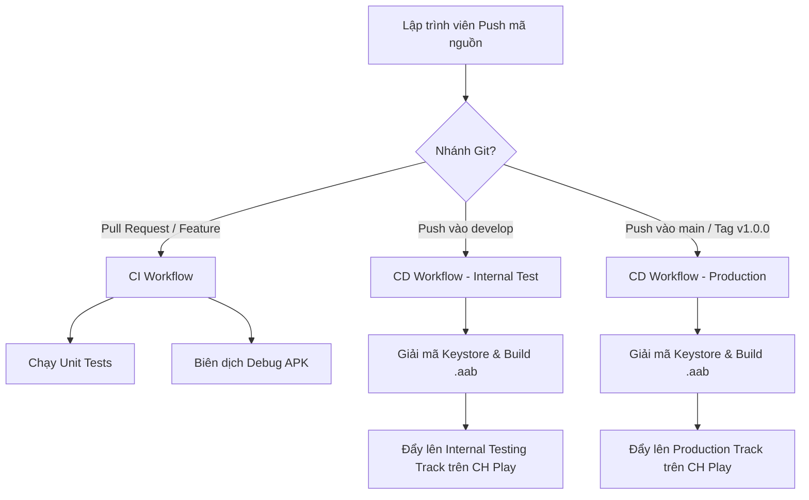

# 🚀 Hướng Dẫn Thiết Lập CI/CD Tự Động Đẩy Ứng Dụng Lên Google Play Store (CH Play)

Tài liệu này hướng dẫn chi tiết từng bước để kết nối kho chứa mã nguồn với hệ thống tự động **GitHub Actions** để biên dịch, ký duyệt mã khóa phát hành (Keystore) và đưa ứng dụng **Talkship** (`com.artifee.talkship`) lên **Google Play Store**.

---

## 1. Danh Sách Các Biến Bảo Mật (GitHub Repository Secrets)

Để hệ thống CI/CD tự động ký và tải ứng dụng lên CH Play, bạn cần thêm 5 biến sau vào **GitHub Settings**:
👉 Vào kho GitHub của bạn $\rightarrow$ **Settings** $\rightarrow$ **Secrets and variables** $\rightarrow$ **Actions** $\rightarrow$ **New repository secret**.

| Tên Secret | Mô tả chi tiết | Ví dụ / Định dạng |
| :--- | :--- | :--- |
| **`SIGNING_KEY_BASE64`** | Chuỗi Mã hóa Base64 của tệp Keystore phát hành (`release.jks`). | `MIIKcQIBAzCC...` |
| **`KEY_ALIAS`** | Tên Alias đại diện cho khóa đăng ký trong Keystore. | `talkship-release-key` |
| **`KEY_PASSWORD`** | Mật khẩu của Key Alias. | `MātKhāuCũaBān123` |
| **`STORE_PASSWORD`** | Mật khẩu bảo vệ của tệp Keystore. | `MātKhāuKeystore123` |
| **`PLAY_CONSOLE_JSON_KEY`** | Chuỗi JSON của Google Play Service Account được cấp quyền API. | `{"type": "service_account", ...}` |

---

## 2. Bước 1: Tạo Tệp Keystore & Mã Hóa Base64

### 1.1 Tạo tệp Release Keystore bằng Command Line
Mở PowerShell trên máy PC của bạn và chạy lệnh:
```powershell
keytool -genkey -v -keystore release.jks -keyalg RSA -keysize 2048 -validity 10000 -alias talkship-release-key
```
*Hệ thống sẽ hỏi Mật khẩu Keystore, Mật khẩu Key Alias, Tên tổ chức. Hãy lưu trữ các mật khẩu này cẩn thận.*

### 1.2 Chuyển tệp Keystore thành chuỗi Base64
Chạy đoạn lệnh PowerShell sau để xuất chuỗi Base64:
```powershell
$bytes = [System.IO.File]::ReadAllBytes("release.jks")
$base64 = [System.Convert]::ToBase64String($bytes)
$base64 | Set-Clipboard
Write-Host "✅ Chuỗi Base64 đã được sao chép vào Clipboard của bạn!" -ForegroundColor Green
```
👉 Dán chuỗi này vào Secret **`SIGNING_KEY_BASE64`** trên GitHub.

---

## 3. Bước 2: Tạo Google Play Service Account (JSON Key)

Để GitHub Actions có quyền tải tệp `.aab` trực tiếp lên Google Play Console:

1. **Vào Google Cloud Console**:
   - Mở [Google Cloud IAM & Admin Console](https://console.cloud.google.com/iam-admin/serviceaccounts).
   - Chọn dự án gắn liền với ứng dụng Google Play của bạn.
   - Nhấn **Create Service Account** $\rightarrow$ Đặt tên `github-actions-play-publisher`.
2. **Cấp quyền Service Account**:
   - Cấp vai trò **Service Account User** hoặc **Editor**.
   - Nhấn vào Service Account vừa tạo $\rightarrow$ Chuyển sang tab **Keys** $\rightarrow$ **Add Key** $\rightarrow$ **Create new key** $\rightarrow$ Chọn **JSON**.
   - Tệp `.json` sẽ tự động tải về máy tính của bạn.
3. **Liên kết với Google Play Console**:
   - Mở [Google Play Console](https://play.google.com/console).
   - Vào **API Access (Quyền truy cập API)** $\rightarrow$ Tìm Service Account vừa tạo và bấm **Grant Access (Cấp quyền)**.
   - Cấp quyền: **Release to production, exclude devices, and use app signing** & **Manage testing tracks**.
4. **Copy JSON Secret**:
   - Mở tệp `.json` vừa tải về bằng Notepad, copy **toàn bộ nội dung văn bản JSON** và dán vào Secret **`PLAY_CONSOLE_JSON_KEY`** trên GitHub.

---

## 4. Mô Hình Hoạt Động Tự Động Theo Nhánh (CI/CD Flow)



---

## 5. Quy Trình Phát Hành Bản Đăng Lên CH Play (Release Checklist)

Khi bạn đã sẵn sàng đưa một phiên bản mới lên CH Play:

1. Merge các tính năng đã kiểm thử từ `develop` vào `main`:
   ```bash
   git checkout main
   git merge develop -m "release: v1.0.0 official launch"
   ```
2. Đánh Tag phiên bản mới và push lên GitHub:
   ```bash
   git tag -a v1.0.0 -m "Bản phát hành chính thức v1.0.0"
   git push origin main --tags
   ```
3. GitHub Actions sẽ tự động kích hoạt workflow `Talkship Android CD`, đóng gói `.aab` ký duyệt khóa chính thức và đẩy thẳng lên **CH Play (Google Play Store)**!
