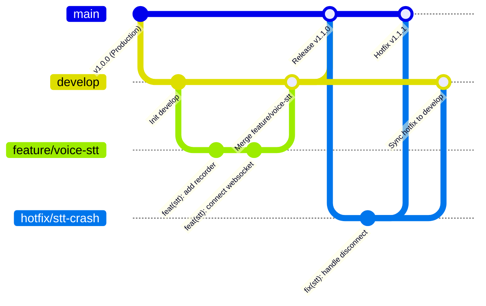

# 🚀 Git Workflow Guide (4-Branch Strategy: Main - Develop - Feature - Hotfix)

This document defines the Git version control strategy for the **Talkship** project. It utilizes a **4-branch model (`main`, `develop`, `feature`, `hotfix`)** optimized for solo developer productivity while maintaining production-grade standards, clean history, and seamless release management.

---

## 1. Branching Strategy Overview



### Branch Responsibilities:

| Branch Name | Purpose & Characteristics | Rules |
| :--- | :--- | :--- |
| 🛡️ **`main`** | **Production Branch**<br>Contains production-ready code published to Google Play / App Store. | • **NO direct commits**.<br>• Accepts merges ONLY from `develop` (for releases) or `hotfix/*`.<br>• Every commit on `main` MUST be tagged with a **Git Tag** (e.g., `v1.0.0`). |
| 🧪 **`develop`** | **Staging / Development Branch**<br>Integrates all upcoming features under active testing. | • Used for building internal testing APKs / Staging builds.<br>• Accepts merges from `feature/*` and `hotfix/*` branches. |
| 🚀 **`feature/*`** | **Feature Branches**<br>Short-lived branches for individual feature development. | • Branch off from `develop`.<br>• Naming pattern: `feature/<feature-name>` (e.g., `feature/voice-recorder`).<br>• Squash and merge back into `develop`, then delete the feature branch. |
| 🚑 **`hotfix/*`** | **Hotfix Branches**<br>Urgent production bug fixes for critical issues. | • Branch off from `main`.<br>• Naming pattern: `hotfix/<bug-name>` (e.g., `hotfix/stt-crash-fix`).<br>• Merge into BOTH `main` (with patch tag, e.g., `v1.1.1`) and `develop`, then delete the branch. |

---

## 2. Step-by-Step Workflow Guide

### 📌 Scenario 1: Developing a New Feature (`feature` $\rightarrow$ `develop`)

#### Step 1: Create a new Feature branch from `develop`
```bash
# 1. Switch to develop and pull latest changes
git checkout develop
git pull origin develop

# 2. Create and switch to new feature branch
git checkout -b feature/audio-waveform
```

#### Step 2: Develop and Commit
Make atomic, descriptive commits following **Conventional Commits**:
```bash
git add .
git commit -m "feat(ui): create Compose Waveform component"
git commit -m "feat(audio): bind real amplitude data to Waveform"
```

#### Step 3: Merge Feature branch into `develop`
```bash
# Switch to develop branch
git checkout develop

# Squash feature commits into a single clean commit on develop
git merge --squash feature/audio-waveform

# Commit the merged feature
git commit -m "feat(ui): complete audio waveform visualizer component"

# Delete local feature branch
git branch -d feature/audio-waveform
```

---

### 📌 Scenario 2: Preparing a Production Release (`develop` $\rightarrow$ `main`)

When `develop` contains all tested features ready for the next release milestone:

#### Step 1: Merge `develop` into `main`
```bash
# 1. Switch to main
git checkout main

# 2. Merge develop branch into main
git merge develop -m "release: launch version v1.1.0"
```

#### Step 2: Tag the Release on `main`
```bash
# Create an annotated release tag
git tag -a v1.1.0 -m "Release v1.1.0: Real-time speech recognition & audio waveform"

# Push commits and tags to remote repository
git push origin main
git push origin v1.1.0

# Switch back to develop for ongoing work
git checkout develop
git push origin develop
```

---

### 📌 Scenario 3: Hotfix for Production Critical Bug (`hotfix` $\rightarrow$ `main` & `develop`)

If a critical crash occurs in production:

```bash
# 1. Create hotfix branch from main
git checkout main
git checkout -b hotfix/stt-crash-fix

# 2. Fix bug and commit
git commit -m "fix(stt): handle unexpected WebSocket disconnect crash"

# 3. Merge hotfix into main & tag patch version
git checkout main
git merge hotfix/stt-crash-fix
git tag -a v1.1.1 -m "Hotfix v1.1.1: Fix STT connection crash"
git push origin main --tags

# 4. Sync hotfix back into develop
git checkout develop
git merge hotfix/stt-crash-fix
git push origin develop

# 5. Delete hotfix branch
git branch -d hotfix/stt-crash-fix
```

---

## 3. Commit Message Convention (Conventional Commits)

Format: `<type>(<scope>): <short summary>`

* `feat`: New feature (`feat(voice): add real-time audio recording`)
* `fix`: Bug fix (`fix(api): fix timeout error during Gemini API call`)
* `ui`: UI/UX styling (`ui(chat): adjust spacing between chat bubbles`)
* `refactor`: Code restructuring without functional changes (`refactor(audio): optimize AudioTrack memory buffer`)
* `chore`: Build config or dependency updates (`chore(deps): upgrade Hilt to 2.51`)

---

## 📌 Quick Reference Command Cheatsheet

| Task | Git Command |
| :--- | :--- |
| **Start a Feature** | `git checkout develop` $\rightarrow$ `git checkout -b feature/<name>` |
| **Merge Feature to Develop** | `git checkout develop` $\rightarrow$ `git merge --squash feature/<name>` |
| **Release to Main** | `git checkout main` $\rightarrow$ `git merge develop` |
| **Tag a Release** | `git tag -a v1.1.0 -m "Release description"` |
| **Start a Hotfix** | `git checkout main` $\rightarrow$ `git checkout -b hotfix/<name>` |
| **Merge Hotfix to Main & Develop** | `git checkout main` $\rightarrow$ `git merge hotfix/<name>` $\rightarrow$ `git tag -a v1.1.1` $\rightarrow$ `git checkout develop` $\rightarrow$ `git merge hotfix/<name>` |
| **Push Tags to Remote** | `git push origin --tags` |
